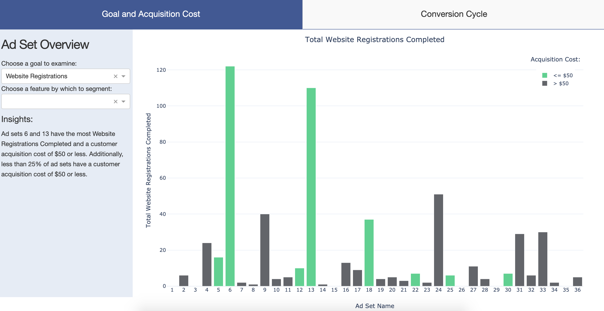
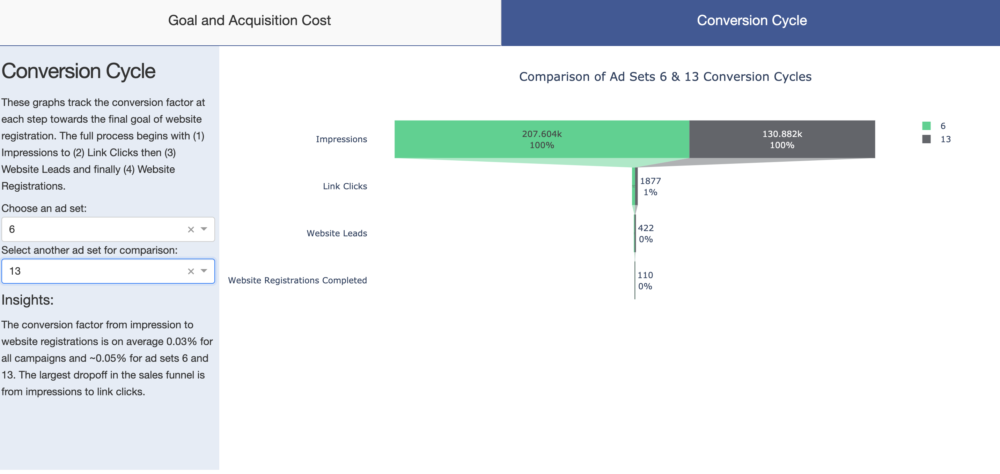

# Analyzing A Facebook Ad Campaign in Dash

## Table of contents
* [General info](#general-info)
* [Technologies](#technologies)
* [Setup](#setup)
* [Results](#results)
* [Status](#status)
* [Contact](#contact)
* [Acknowledgements](#acknowledgements)

## General info
This data is from a Facebook ad campaign. The campaign is focused on customer acquisition versus brand awareness. The primary goal is “Website Registrations Completed” and the secondary goal is “Website Leads.” The target acquisition cost was $50 or less. 

In this project, I created a tool in Plotly's dash to explore the data set and assess each ad set's performance against the primary and secondary goals.

The application is deployed on Heroku at this [link.](#https://ad-campaign-analysis.herokuapp.com/)

## Technologies
* Python 3.7
* Heroku

## Setup
Use requirements.txt file to install required packages, or install packages and versions listed below:

* dash_ core_components==1.3.1
* dash==1.4.1
* pandas==1.0.5
* dash_ html_components==1.0.1
* plotly==4.8.2
* numpy==1.18.5
* gunicorn==20.0.4

## Results
Overall ad sets 6 and 13 were most successful at achieving website registrations and website leads while maintaining a customer acquisition cost of $50 or less. 

A closer look at the conversion cycle for the ad sets shows that the largest abandonment rate occurs between impressions and link clicks. 

### Ad Set Analysis Insights and Recommendation:
| Key Insight | Recommendation |
| ------ | ----- |
| There were 0 impressions/reach/registrations for customers within age groups of 18-24 and 45+ | Re-asses the content contained in the ads and explore other modes of advertising for these groups such as pay-per-click | 
| Money was spent on campaigns that received little or no website registrations | Re-invest this money to fund campaigns 6 and 13 since they were the most successful |
| The conversion factor from impression to website registrations is on average 0.03% for all campaigns and around 0.05% for ad sets 6 and 13 | Analyze pain points within conversion cycle to improve inefficiencies and decrease attrition | 
| The acquisition cost for ad set 6 is under $50 for all demographics. The acquisition cost for ad set 13 is under $50 for most demographics | Use ad set 6 to target all demographics including males, females, unknown, and ages 25-44 and use ad set 13 to target males who are 25-34 | 

## Status
Project is: _In Progress_

## Contact
Created by [Gabrielle Nyirjesy](https://www.linkedin.com/in/gabrielle-nyirjesy) - feel free to contact me!

## Acknowledgements
Thank you to @amyoshino for the [css template.](#https://codepen.io/amyoshino/pen/jzXypZ.css)